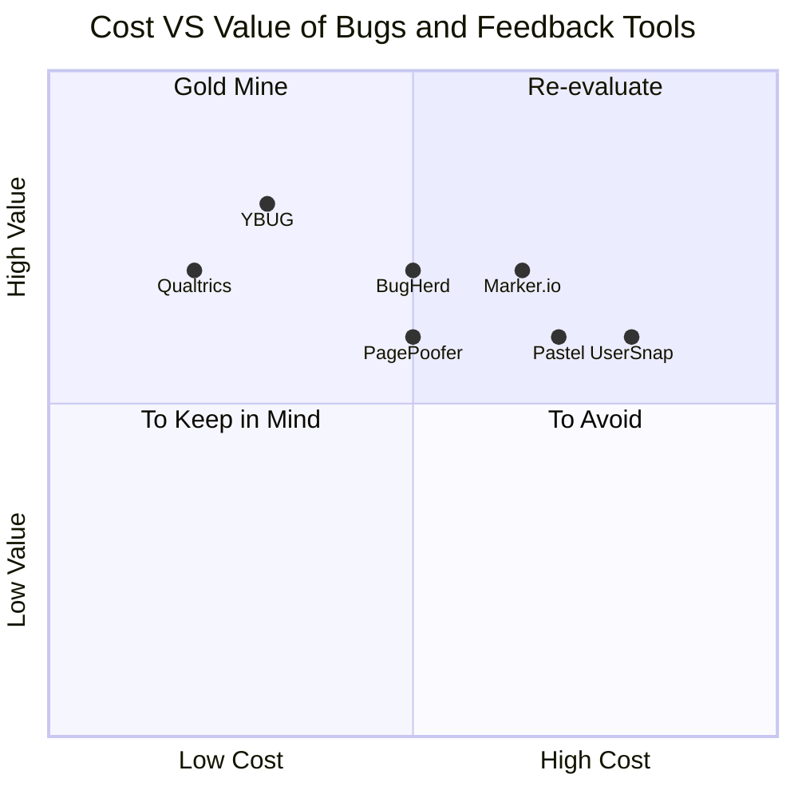

```mermaid
quadrantChart
    title Cost VS Value of Bugs and Feedback Tools
    x-axis Low Cost --> High Cost
    y-axis Low Value --> High Value
    quadrant-1 Re-evaluate
    quadrant-2 Gold Mine
    quadrant-3 To Keep in Mind
    quadrant-4 To Avoid
    YBUG: [0.3, 0.8]
    Marker.io: [0.65, 0.7]
    BugHerd: [0.5, 0.7]
    UserSnap: [0.8, 0.6]
    PagePoofer: [0.5, 0.6]
    Pastel: [0.7, 0.6]
    Qualtrics: [0.2, 0.7]
```