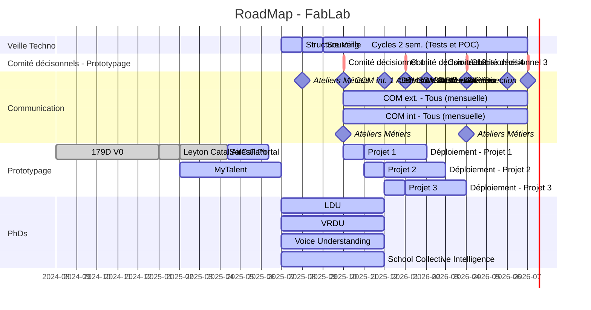

```mermaid
---
displayMode: compact
---
gantt
    title RoadMap - FabLab
    dateFormat YYYY-MM-DD
    axisFormat %Y-%m
    tickInterval 1month
   
 
    section Veille Techno
        Structure Veille            :   active  ,   a1,     2025-07-01, 1M
        Sourcing                    :   active  ,   a2,     after a1,   1M
        Cycles 2 sem. (Tests et POC):   active  ,   a3,     after a2,   10M
       
    section Comité décisonnels - Prototypage
        Comité décisionnel 1        :   crit    ,   2025-10  ,   2d
        Comité décisionnel 2        :   crit    ,   2026-01  ,   2d
        Comité décisionnel 3        :   crit    ,   2026-04  ,   2d
        Comité décisionnel 4        :   crit    ,   2026-07  ,   2d
 
    section Communication      
        COM int. 1 - Direction      :   milestone,  2025-10,    1d  
        COM int. 2 - Direction      :   milestone,  2026-01,    1d  
        COM int. 3 - Direction      :   milestone,  2026-04,    1d  
        COM int. 4 - Direction      :   milestone,  2026-07,    1d
        COM ext. - Tous (mensuelle)  :  active,     2025-10,    9M
        COM int - Tous (mensuelle)  :   active,     2025-10,    9M
        Ateliers Métiers            :   milestone,  2025-08,    2h
        Ateliers Métiers            :   milestone,  2025-10,    2h
        Ateliers Métiers            :   milestone,  2025-12,    2h
        Ateliers Métiers            :   milestone,  2026-02,    2h
        Ateliers Métiers            :   milestone,  2026-04,    2h  
        Ateliers Métiers            :   milestone,  2026-06,    2h      
 
    section Prototypage
        179D V0                     :   done    ,   b1,     2024-08-01, 5M
        Leyton Catal.               :   done    ,   b2,     after b1,   1M
        AirCall Portal              :   done    ,   b3,     after b2,   10w
        MyTalent                    :   active  ,   b4,     after b2,   5M
        SalesPath                   :   active  ,   b5,     after b3,   2M
        Projet 1                    :   active  ,   b6,     2025-10,    1M
        Déploiement - Projet 1      :   active  ,   b9,     2025-11,    3M
        Projet 2                    :   active  ,   b7,     2025-11,    1M
        Déploiement - Projet 2      :   active  ,   b9,     2025-12,    3M
        Projet 3                    :   active  ,   b8,     2025-12,    1M
        Déploiement - Projet 3      :   active  ,   b9,     2026-01,    3M
 
    section PhDs
        LDU                         :       active, 2025-07-01, 5M
        VRDU                        :       active, 2025-07-01, 5M
        Voice Understanding         :       active, 2025-07-01, 5M
        School Collective Intelligence :    active, 2025-07-01, 5M
```
