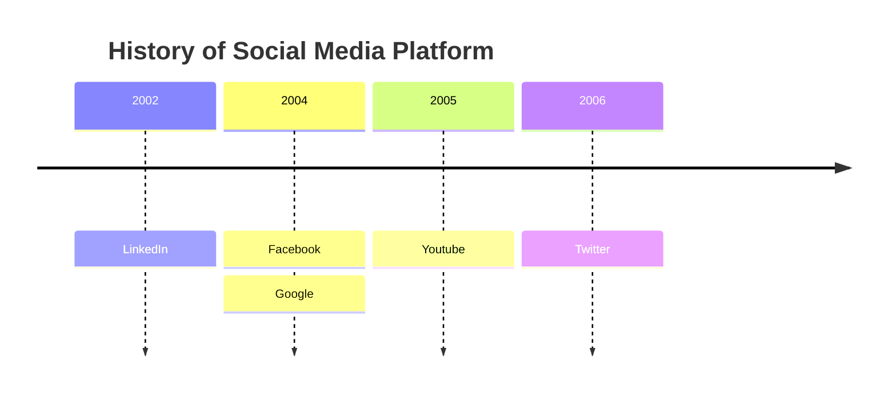

```mermaid
graph TD
    subgraph Read_Heavy_System
        A[Read-Heavy System]
        A -->|Consider| B[Use Cache]
    end
    
    subgraph Low_Latency_System
        C[Low-Latency System]
        C -->|Consider| D[Use Cache & CDN]
    end
    
    subgraph Write_Heavy_System
        E[Write-Heavy System]
        E -->|Consider| F[Use Message Queue for Async Processing]
    end
    
    subgraph ACID_Compliant_System
        G[ACID Compliant System]
        G -->|Go for| H[RDBMS or SQL Database]
    end
    
    subgraph Unstructured_Data
        I[Unstructured Data]
        I -->|Go for| J[NO-SQL Database]
    end
    
    subgraph Complex_Data
        K[Complex Data (e.g., videos, images, files)]
        K -->|Go for| L[Blob/Object Storage]
    end
    
    subgraph Complex_Precomputation
        M[Complex Pre-computation (e.g., news feed)]
        M -->|Consider| N[Use Message Queue & Cache]
    end
    
    subgraph High_Volume_Search
        O[High Volume Search]
        O -->|Consider| P[Use Search Index, Tries, or Search Engine (e.g., Elasticsearch)]
    end
    
    subgraph Scale_SQL_Database
        Q[Scale SQL Database]
        Q -->|Consider| R[Use Database Sharding]
    end
    
    subgraph High_Availability_System
        S[High Availability System]
        S -->|Consider| T[Use Load Balancer]
    end
    
    subgraph Global_Data_Delivery
        U[Global Data Delivery]
        U -->|Consider| V[Use CDN]
    end
    
    subgraph Complex_Relationships
        W[Complex Relationships (e.g., friend lists, road connections)]
        W -->|Consider| X[Use Graph Database]
    end
    
    subgraph Scaling_Components
        Y[Scale Various Components (e.g., servers, databases)]
        Y -->|Consider| Z[Use Horizontal Scaling]
    end
    
    subgraph High_Performing_Queries
        AA[High-Performing Database Queries]
        AA -->|Consider| BB[Use Database Indexes]
    end
    
    subgraph Bulk_Job_Processing
        CC[Bulk Job Processing]
        CC -->|Consider| DD[Use Batch Processing & Message Queues]
    end
    
    subgraph Server_Load_Reduction
        EE[Reduce Server Load]
        EE -->|Consider| FF[Use Rate Limiter]
    end
    
    subgraph Microservices
        GG[Microservices]
        GG -->|Consider| HH[Use API Gateway]
    end
    
    subgraph Single_Point_of_Failure
        II[Single Point of Failure]
        II -->|Implement| JJ[Redundancy]
    end
    
    subgraph Fault_Tolerance_Durability
        KK[Fault Tolerance & Durability]
        KK -->|Implement| LL[Data Replication]
    end
    
    subgraph User_to_User_Communication
        MM[User-to-User Communication]
        MM -->|Consider| NN[Use Websockets]
    end
    
    subgraph Failure_Detection
        OO[Failure Detection (Distributed System)]
        OO -->|Consider| PP[Implement Heartbeat]
    end
    
    subgraph Data_Integrity
        QQ[Ensure Data Integrity]
        QQ -->|Implement| RR[Use Checksum Algorithm]
    end
    
    subgraph Data_Transfer
        SS[Transfer Data (Decentralized)]
        SS -->|Go for| TT[Use Gossip Protocol]
    end
    
    subgraph Efficient_Scaling
        UU[Scale Servers Efficiently]
        UU -->|Implement| VV[Consistent Hashing]
    end
    
    subgraph Location_Related
        WW[Deal with Location (e.g., maps, nearby resources)]
        WW -->|Consider| XX[Use Quadtree, Geohash, etc.]
    end
    
    subgraph Specific_Technology
        YY[Avoid Specific Technology Names]
    end
    
    subgraph Eventual_Consistency
        ZZ[High Availability Requires Eventual Consistency]
    end
    
    subgraph Limit_Data_for_Network_Request
        AAA[Limit Data for Network Request]
        AAA -->|Implement| BBB[Pagination]
    end
```
